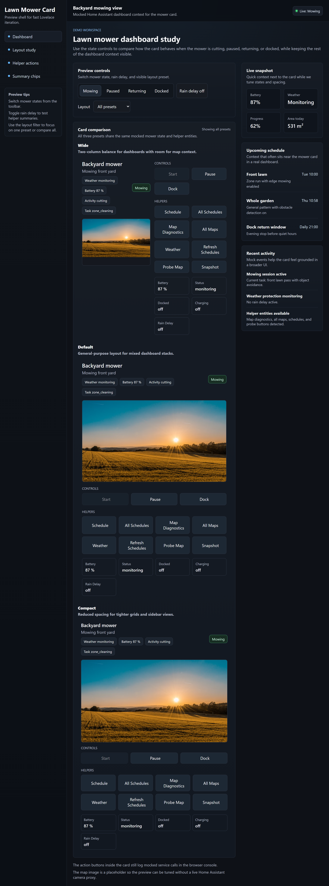

# Lawn Mower Card for Home Assistant

[](https://hacs.xyz/)
[](https://github.com/EvotecIT/lovelace-lawn-mower-card/actions/workflows/validate.yml)
[](https://github.com/EvotecIT/lovelace-lawn-mower-card/actions/workflows/release.yml)
[](LICENSE)

Custom Lovelace card for robotic lawn mowers in Home Assistant.

This card is intended to be a mower-native dashboard surface rather than a
vacuum card adaptation. It starts with the basics that work across mower
integrations today:

- mower state and activity
- optional map camera
- start, pause, and dock controls
- optional selector controls for map, mowing action, zone, spot, and edge entities
- configurable status tiles
- room to grow into richer map and zone workflows later

The first target is the Dreame and MOVA mower protocol family through
`homeassistant-dreamelawnmower`, but the card is designed to stay useful for
other integrations that expose a standard `lawn_mower` entity plus companion
entities.



## Installation

### HACS

1. Open HACS.
2. Add this repository as a custom frontend repository.
3. Install **Lawn Mower Card**.
4. Add the resource if HACS does not do it automatically:

```yaml
url: /hacsfiles/lovelace-lawn-mower-card/lawn-mower-card.js
type: module
```

### Manual

1. Build or download `lawn-mower-card.js`.
2. Place it in your Home Assistant `www` directory.
3. Add it as a Lovelace resource:

```yaml
url: /local/lawn-mower-card.js
type: module
```

## Configuration

```yaml
type: custom:lawn-mower-card
entity: lawn_mower.dreame_a2_bodzio
name: Backyard mower
layout: wide
map_entity: camera.dreame_a2_bodzio_map
show_map: true
status_entity: sensor.dreame_a2_bodzio_state_name
battery_entity: sensor.dreame_a2_bodzio_battery
progress_entity: sensor.dreame_a2_bodzio_weather_protection_status
show_default_actions: true
show_helper_actions: true
control_entities:
  - select.dreame_a2_bodzio_mowing_action
  - select.dreame_a2_bodzio_zone
  - select.dreame_a2_bodzio_spot
summary_entities:
  - sensor.dreame_a2_bodzio_state_name
  - sensor.dreame_a2_bodzio_weather_protection_status
actions:
  - type: more-info
    label: Details
  - type: service
    label: Weather
    icon: mdi:weather-rainy
    service: button.press
    service_data:
      entity_id: button.dreame_a2_bodzio_capture_weather_probe
tiles:
  - entity: binary_sensor.dreame_a2_bodzio_docked
    label: Docked
  - entity: binary_sensor.dreame_a2_bodzio_charging
    label: Charging
  - entity: sensor.dreame_a2_bodzio_error
    label: Error
```

## Card Options

- `entity`: required `lawn_mower` entity id
- `name`: optional card title override
- `layout`: optional `default`, `compact`, or `wide`
- `map_entity`: optional camera entity for the mower map
- `show_map`: optional boolean override for the map section
- `status_entity`: optional entity shown as the primary subtitle
- `battery_entity`: optional entity shown in a stat tile
- `progress_entity`: optional entity shown in a stat tile
- `show_default_actions`: optional boolean, defaults to `true`
- `show_helper_actions`: optional boolean, defaults to `true`
- `control_entities`: optional list of `select` entities rendered as inline mower controls
- `summary_entities`: optional list of entities rendered as header summary chips
- `actions`: optional list of extra action chips
  - `type`: one of `start`, `pause`, `dock`, `more-info`, or `service`
  - `label`: optional button label override
  - `icon`: optional MDI icon override
  - `entity`: optional target entity for `type: more-info`
  - `service`: required for `type: service`, using `domain.service` format
  - `service_data`: optional service data payload for `type: service`
- `tiles`: optional list of extra stat tiles
  - `entity`: entity id
  - `label`: optional tile label override
  - `icon`: optional MDI icon override

The built-in visual editor now covers the main card fields, explicit
`control_entities`, `summary_entities`, extra `tiles`, and custom `actions`.
`service_data` for service actions is edited as JSON in the editor, and entity
fields offer browser suggestions from the entities Home Assistant already knows
about. When you select a mower entity, the editor also tries to prefill common
companion entities such as map, state, battery, status tiles, and mower select
controls without overwriting deliberate custom choices. With the Dreame mower
integration, that companion autofill now also picks up live-session summary
chips such as current zone, cut area, mowing time, and active segments when
those sensors exist.

## Layout Modes

- `default`: balanced layout for most dashboards
- `compact`: tighter spacing for smaller grid cards
- `wide`: puts the map on the left and actions/stats on the right when space allows

## Header Summary

The card builds header summary chips from the best information it can find.

By default it will try to use:

- battery from the configured battery entity or mower attributes
- activity and task from mower attributes
- companion binary sensors such as `docked`, `charging`, and `rain_delay_active`
- companion sensors such as `weather_protection_status`
- active error information

You can also add explicit `summary_entities` when you want tighter control over
what appears in the header.

If you leave `summary_entities` empty, the card and visual editor will try to
auto-detect live-session companions for integrations that expose them,
including:

- `sensor.my_mower_current_zone`
- `sensor.my_mower_current_cleaned_area`
- `sensor.my_mower_current_cleaning_time`
- `sensor.my_mower_active_segment_count`
- `sensor.my_mower_current_app_map_trajectory_point_count`

## Smart Helper Actions

When `show_helper_actions` is enabled, the card will look for companion
entities that share the mower entity object id and expose helper chips when
they exist. This is especially useful with `homeassistant-dreamelawnmower`.

Current auto-detected helpers include:

- schedule calendar
- all-schedules calendar
- map diagnostics camera
- all-maps camera
- weather probe button
- schedule probe button
- map probe button
- operation snapshot button

## Control Selectors

When compatible `select` entities exist, the card can render them as direct
inline controls. This is especially useful for Dreame and MOVA mower setups
that expose entities such as:

- `select.my_mower_map`
- `select.my_mower_mowing_action`
- `select.my_mower_edge`
- `select.my_mower_zone`
- `select.my_mower_spot`

If you do not set `control_entities`, the card will try to auto-detect these
companions from the mower object id.

## Development

```bash
npm install
npm run build
```

To verify the exact release payload locally:

```bash
npm run pack
```

For watch mode:

```bash
npm run dev
```

For a standalone browser preview with mocked mower data:

```bash
npm run preview
```

Then open:

```text
http://localhost:4173/
```

The preview page renders multiple layout presets inside a mocked Home Assistant
dashboard shell so spacing, summary chips, helper actions, and surrounding
context are easier to judge at a glance. You can switch mower states, toggle
rain delay, and focus on a single layout preset or compare all of them side by
side.

## Releases

Version tags in the `vX.Y.Z` format trigger the release workflow. Each tagged
release rebuilds the card, packages the release payload, and attaches
`lawn-mower-card.js`, `README.md`, `hacs.json`, and `LICENSE` to the GitHub
release so frontend users have a clean downloadable artifact. You can also run
the workflow manually to verify the packaging step without publishing a
release.

## Scope

This card still does not try to solve every mower workflow on day one. Interactive
map editing, no-go editing, and deeper integration-specific write paths should be
added only after the backend contracts are stable.
