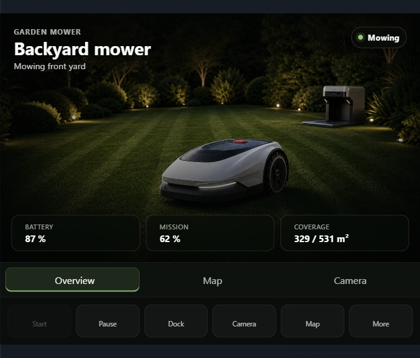
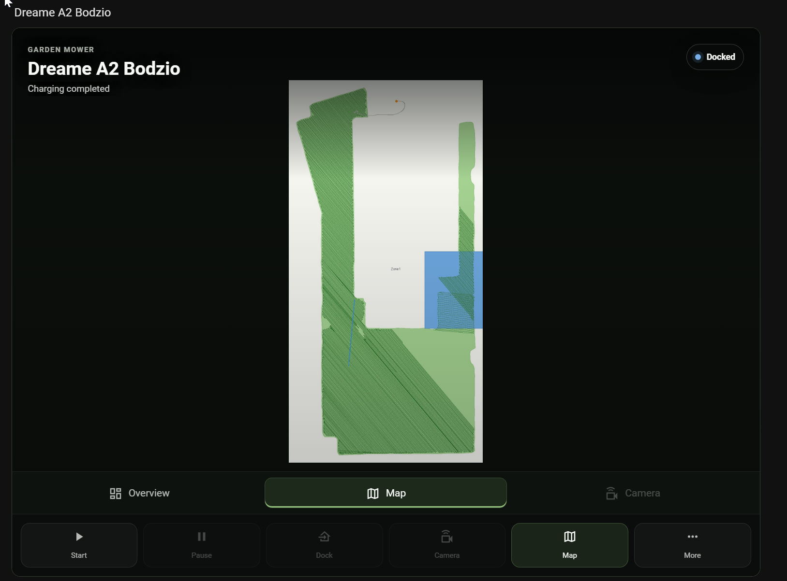

# Lawn Mower Card for Home Assistant

[](https://hacs.xyz/)
[](https://github.com/EvotecIT/lovelace-lawn-mower-card/actions/workflows/validate.yml)
[](https://github.com/EvotecIT/lovelace-lawn-mower-card/actions/workflows/release.yml)
[](LICENSE)

Give a Home Assistant lawn mower a dashboard that looks and behaves like a
mower—not a renamed vacuum card.



The Hero layout puts state, battery, mission coverage, map, live camera, and the
primary controls on one responsive surface. Traditional compact, default, and
wide layouts remain available for denser dashboards.

The card works with a standard `lawn_mower` entity and becomes richer when an
integration exposes companion map, camera, schedule, and telemetry entities:

- mower state and activity
- optional map camera, with live-path overlays preferred when the integration exposes them
- start, pause, and dock controls
- context-aware selectors for the map, mowing action, and current target
- direct access to live video, schedules, and mower maps when those entities exist
- an image-led Hero layout with in-card Overview, Map, and Camera views
- optional advanced planning and live-session telemetry
- configurable status tiles
- room to grow into richer map and zone workflows later

The first fully exercised pairing is
[Dreame Lawn Mower](https://github.com/EvotecIT/homeassistant-dreamelawnmower),
but the card remains integration-agnostic at its core.



## 🧩 More from Evotec

Our Home Assistant projects:

- [Dreame Lawn Mower](https://github.com/EvotecIT/homeassistant-dreamelawnmower)
  with its companion
  [Lawn Mower Card](https://github.com/EvotecIT/lovelace-lawn-mower-card)
- [Siegenia](https://github.com/EvotecIT/homeassistant-siegenia) for local
  window control
- [KEF](https://github.com/EvotecIT/homeassistant-kef) for local speaker control
- [Devialet](https://github.com/EvotecIT/homeassistant-devialet) for local
  speaker control
- [EasyControlX](https://github.com/EvotecIT/homeassistant-easycontrolx) for
  workstation control

Our Apple apps:

- [CasaRay](https://casaray.dev/) offers a calm whole-home view on iPhone, iPad,
  and Mac. [View it on the App Store](https://apps.apple.com/us/app/casaray/id6778025328).
- [Tactra Remote](https://tactra.dev/) focuses on Home Assistant media control
  across iPhone, iPad, Apple Watch, and Mac.
  [View it on the App Store](https://apps.apple.com/us/app/tactra-remote/id6775426723).

CasaRay's complete-home Free experience remains genuinely useful. CasaRay Plus
and Tactra purchases help fund continued work on that free experience and these
open-source Home Assistant projects. If you prefer to support the open-source
work directly, [GitHub Sponsors](https://github.com/sponsors/PrzemyslawKlys) is
another option. None of them is required to use this project.

## Installation

### HACS

1. Open HACS and search for **Lawn Mower Card** in the dashboard catalog.
2. Install the card and restart Home Assistant if HACS asks you to.
3. If the card is not in the catalog yet, add
   `https://github.com/EvotecIT/lovelace-lawn-mower-card` as a custom
   **Dashboard** repository, then install it.
4. Add the resource only if HACS does not do it automatically:

```yaml
url: /hacsfiles/lovelace-lawn-mower-card/lawn-mower-card.js
type: module
```

### Manual

1. Build or download `lawn-mower-card.js`.
2. Place it in your Home Assistant `www` directory.
3. Add it as a Lovelace resource:

```yaml
url: /local/lawn-mower-card.js
type: module
```

## Configuration

### Visual editor (recommended)

You do not need to write YAML to use the card:

1. Open a dashboard and choose **Edit dashboard**.
2. Select **Add card**, then search for **Lawn Mower Card**.
3. Choose the mower entity and a layout. The editor safely fills compatible
   map, live-video, state, battery, progress, and control entities when it can.
4. Review the live preview and save the card.

The editor also supports explicit companion entities, control selectors,
summary chips, extra tiles, custom actions, and advanced planning and telemetry
without requiring raw configuration changes.

### Custom Hero background

Select the **Hero** layout to reveal a **Hero appearance** section in the visual
editor. Enter either an HTTPS image URL or a Home Assistant `/local/...` path,
then choose the part of the image that should stay in focus.

For an image stored on your Home Assistant instance:

1. Copy it to `/config/www/mower/my-mower.jpg`.
2. Set **Background image** to `/local/mower/my-mower.jpg`.
3. Choose **Center**, **Left**, **Right**, **Top**, or **Bottom** under
   **Image focus**.

Do not put personal images inside the HACS card directory: HACS owns that folder
and can replace it during an update. Clear **Background image** to restore the
built-in artwork. If a custom image cannot be loaded, the card also falls back
to the built-in artwork automatically.

The equivalent optional YAML is:

```yaml
type: custom:lawn-mower-card
entity: lawn_mower.dreame_a2_bodzio
layout: hero
hero_image: /local/mower/my-mower.jpg
hero_image_position: right
```

### YAML (optional)

The Hero layout keeps the main controls and telemetry on one surface, then
switches the media area between overview artwork, mower map, and live camera.
It preloads the map with a stable Home Assistant entity revision, avoiding a new
cache-busting request on every dashboard update. Live video still starts only
after you open Camera, so a dashboard view never opens an expensive mower video
session by itself.

For compatible integrations, this minimal configuration is often enough:

```yaml
type: custom:lawn-mower-card
entity: lawn_mower.dreame_a2_bodzio
layout: hero
```

Use explicit companion entities when your entity names differ from the mower's
object id:

```yaml
type: custom:lawn-mower-card
entity: lawn_mower.dreame_a2_bodzio
name: Backyard mower
layout: hero
map_entity: camera.dreame_a2_bodzio_live_path_map
camera_entity: camera.ogrod_dreame_a2_bodzio_live_video
status_entity: sensor.dreame_a2_bodzio_state_name
battery_entity: sensor.dreame_a2_bodzio_battery
progress_entity: sensor.dreame_a2_bodzio_runtime_mission_progress
coverage_entity: sensor.dreame_a2_bodzio_current_cleaned_area
coverage_total_entity: sensor.dreame_a2_bodzio_runtime_total_area
```

Automatic companion discovery can fill most of these entities for compatible
integrations. Existing dashboards keep their current layout unless
`layout: hero` is selected.

The Hero action rail follows `show_default_actions` and
`show_helper_actions`. Extra configured tiles, custom actions, and advanced
planning panels remain available in the traditional layouts.

For the traditional map-and-controls layouts, the full configuration remains
available:

```yaml
type: custom:lawn-mower-card
entity: lawn_mower.dreame_a2_bodzio
name: Backyard mower
layout: wide
map_entity: camera.dreame_a2_bodzio_live_path_map
show_map: true
status_entity: sensor.dreame_a2_bodzio_state_name
battery_entity: sensor.dreame_a2_bodzio_battery
progress_entity: sensor.dreame_a2_bodzio_runtime_mission_progress
show_default_actions: true
show_helper_actions: true
show_advanced_details: false
actions:
  - type: more-info
    label: Details
tiles:
  - entity: binary_sensor.dreame_a2_bodzio_docked
    label: Docked
  - entity: binary_sensor.dreame_a2_bodzio_charging
    label: Charging
  - entity: sensor.dreame_a2_bodzio_error
    label: Error
```

## Card Options

- `entity`: required `lawn_mower` entity id
- `name`: optional card title override
- `layout`: optional `default`, `compact`, `wide`, or `hero`
- `hero_image`: optional Hero overview background. Use an HTTPS URL or a
  `/local/...` path for a file stored under Home Assistant's `config/www`.
- `hero_image_position`: optional image focus: `center` (default), `left`,
  `right`, `top`, or `bottom`
- `map_entity`: optional camera entity for the mower map. If your integration
  exposes a live-path or runtime-overlay camera, prefer that over a static map
  camera so the card can show the current cut path.
- `camera_entity`: optional live-video camera used by the Hero Camera view. A
  compatible companion camera is detected automatically when this is omitted.
- `show_map`: optional boolean override for the map section
- `status_entity`: optional entity shown as the primary subtitle
- `battery_entity`: optional entity used for the compact header summary
- `progress_entity`: optional mission-progress sensor, normally measured in `%`;
  unrelated status entities are ignored by the Hero mission tile
- `coverage_entity`: optional current or completed mowed-area sensor used by the
  Hero coverage metric
- `coverage_total_entity`: optional total or target-area sensor displayed
  alongside `coverage_entity`
- `show_default_actions`: optional boolean, defaults to `true`
- `show_helper_actions`: optional boolean, defaults to `true`
- `show_advanced_details`: optional boolean, defaults to `false`; shows the
  Planned Run and Live Session panels
- `control_entities`: optional list of `select` entities rendered as inline mower controls
- `summary_entities`: optional list of entities rendered as header summary chips
- `actions`: optional list of extra action chips
  - `type`: one of `start`, `pause`, `dock`, `more-info`, or `service`
  - `label`: optional button label override
  - `icon`: optional MDI icon override
  - `entity`: optional target entity for `type: more-info`
  - `service`: required for `type: service`, using `domain.service` format
  - `service_data`: optional service data payload for `type: service`
- `tiles`: optional list of extra stat tiles
  - `entity`: entity id
  - `label`: optional tile label override
  - `icon`: optional MDI icon override

The built-in visual editor covers the main card fields, Hero appearance,
explicit `control_entities`, `summary_entities`, extra `tiles`, and custom
`actions`.
`service_data` for service actions is edited as JSON in the editor, and entity
fields offer browser suggestions from the entities Home Assistant already knows
about. When you select a mower entity, the editor also tries to prefill common
companion entities such as map, state, battery, status tiles, and mower select
controls without overwriting deliberate custom choices. With the Dreame mower
integration, the normal card stays focused on current state and actions. Enable
`show_advanced_details` when you want the selected-map plan and detailed runtime
telemetry on the dashboard.
When multiple mower cameras exist, the card now prefers a `live_path_map`
camera first so the main preview follows the currently cut area instead of only
the broader stored map.

## Layout Modes

- `default`: balanced layout for most dashboards
- `compact`: tighter spacing for smaller grid cards
- `wide`: puts the map on the left and actions/stats on the right when space allows
- `hero`: image-led overview with live battery, mission, and coverage values;
  Overview, Map, and Camera views; and a compact primary action rail

With the Dreame integration, completed runtime mission and area values remain
available after docking. The Hero layout labels those values `Last mission` and
`Last coverage`, then switches back to live labels when the next mowing session
starts. Other integrations can opt into the same presentation by exposing
`cached: true` on their progress or coverage entity attributes.

## Header Summary

The card builds header summary chips from the best information it can find.

By default it will try to use:

- battery from the configured battery entity or mower attributes
- runtime mission progress
- current and total area coverage
- an active rain delay
- active error information

You can also add explicit `summary_entities` when you want tighter control over
what appears in the header.

## Smart Helper Actions

When `show_helper_actions` is enabled, the card will look for companion
entities that share the mower entity object id and expose helper chips when
they exist. This is especially useful with `homeassistant-dreamelawnmower`.

Current auto-detected helpers include:

- live-video camera
- schedule calendar
- live-path map camera
- all-maps camera

Diagnostic probes and maintenance operations remain available on the Home
Assistant device page, but the card does not present them as everyday actions.

## Control Selectors

When compatible `select` entities exist, every layout, including Hero, can
render them as direct inline controls. This is especially useful for Dreame and
MOVA mower setups that expose entities such as:

- `select.my_mower_map`
- `select.my_mower_mowing_action`
- `select.my_mower_edge`
- `select.my_mower_zone`
- `select.my_mower_spot`

If you do not set `control_entities`, the card will try to auto-detect these
companions from the mower object id. It always shows the map and mowing-action
selectors when available, then shows only the target selector relevant to the
current action. For example, `All area` hides the edge, zone, and spot fields;
`Zone` shows only the zone field. An explicit `control_entities` list is left
unchanged.

## Planned Run Preview

When `show_advanced_details` is enabled and the mower exposes current selection
details, the card renders a `Planned Run` panel that summarizes:

- selected mowing action
- selected map
- selected map preference mode when the integration exposes it
- active map when it differs from the selected map
- the selected zone, spot, or edge target
- selected-zone mowing preferences such as height, efficiency, direction, and obstacle avoidance

For Dreame mower setups this helps confirm the scoped run before pressing the
main `Start` action. When the selected map is still in global preference mode,
the panel also warns that zone-specific mowing settings may not be active yet.

When available, the card reads these companion sensors directly:

- `sensor.my_mower_selected_zone_mowing_height`
- `sensor.my_mower_selected_zone_efficiency_mode`
- `sensor.my_mower_selected_zone_direction_mode`
- `sensor.my_mower_selected_zone_obstacle_avoidance`
- `sensor.my_mower_selected_zone_obstacle_distance`
- `sensor.my_mower_selected_zone_obstacle_height`
- `sensor.my_mower_selected_zone_obstacle_classes`

If some of those sensors are missing, the card can still fall back to the mower
entity's `selected_zone_preference` attributes when the integration exposes
them.

## Live Session Panel

When `show_advanced_details` is enabled and the card can see live-session
companions, it renders a `Live Session` panel that can summarize:

- runtime mission progress
- current and total area coverage
- current zone
- Bluetooth connectivity
- live runtime trail length, points, segments, heading, and position

If a map camera is configured, the panel also reads runtime overlay details
from the map entity attributes. If no map camera is configured, the panel still
shows the companion sensor and binary-sensor data it can resolve.

## Development

```bash
npm install
npm test
npm run check
npm run build
```

To verify the exact release payload locally:

```bash
npm run pack
```

For watch mode:

```bash
npm run dev
```

For a standalone browser preview with mocked mower data:

```bash
npm run preview
```

Then open:

```text
http://localhost:4173/
```

The preview page renders multiple layout presets inside a mocked Home Assistant
dashboard shell so spacing, summary chips, helper actions, and surrounding
context are easier to judge at a glance. You can switch mower states, toggle
rain delay, and focus on a single layout preset or compare all of them side by
side.

## Releases

Merged pull requests drive releases. Add one release label before merging when
the default policy is not enough: `release:none`, `release:patch`,
`release:minor`, or `release:major`. PowerForge updates the package metadata,
runs the repository tests and type check, packages `lawn-mower-card.js`, and
publishes the matching GitHub release from the prepared version commit.

The Release workflow can also recover a merged pull request. Run it manually
with the pull request number and, when available, its merge commit SHA; leave
the increment on `auto` unless the original label decision must be overridden.

## Scope

This card still does not try to solve every mower workflow on day one. Interactive
map editing, no-go editing, and deeper integration-specific write paths should be
added only after the backend contracts are stable.
