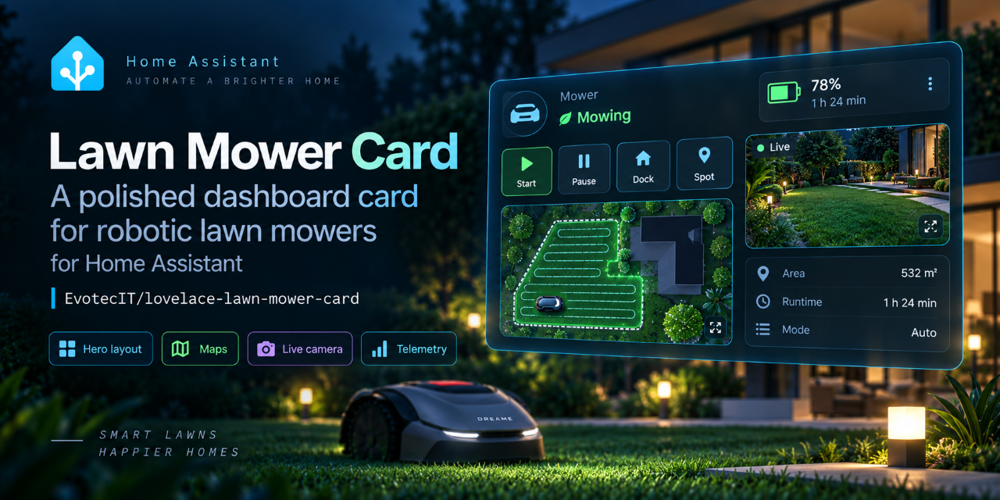
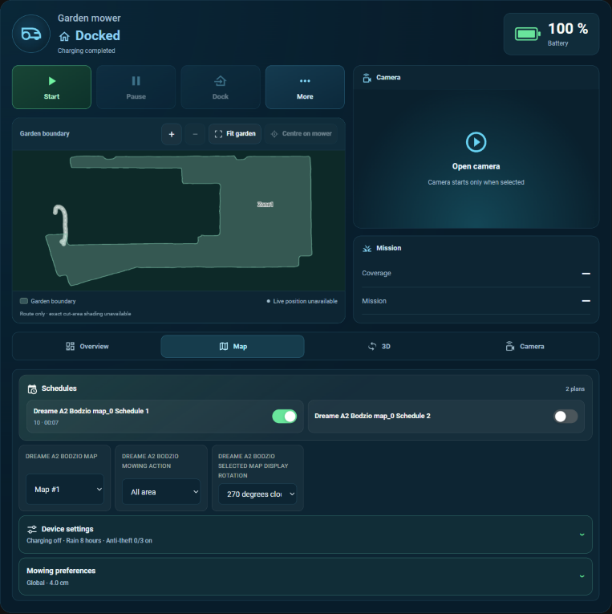
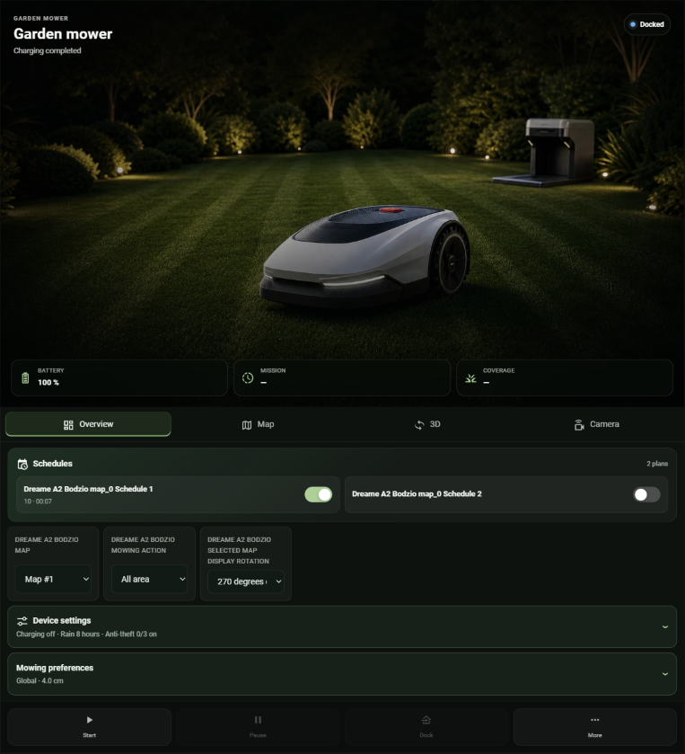
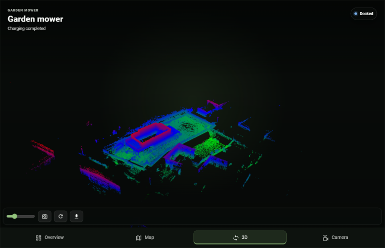
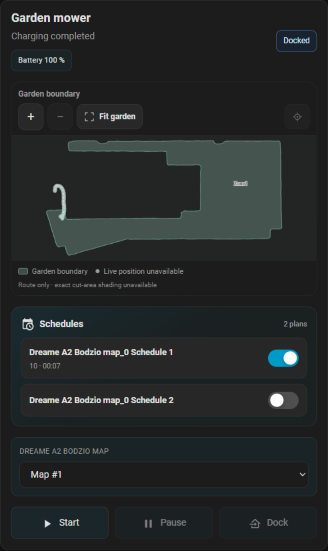
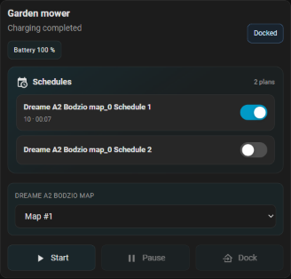

# Lawn Mower Card for Home Assistant



[](https://hacs.xyz/)
[](https://github.com/EvotecIT/lovelace-lawn-mower-card/actions/workflows/validate.yml)
[](LICENSE)

## Overview

A dashboard card for Home Assistant `lawn_mower` entities, with mower state,
battery, and supported Start, Pause, and Dock controls.

Choose an image-led **Hero** layout, its optional **Dashboard** composition, or
the **Default**, **Compact**, and **Wide** layouts. Compatible integrations add
maps, live video, 3D point clouds, schedules, and mowing preferences without
requiring a separate card for every control.

Start with one mower entity. Optional views appear only when their companion
entities are available. The card works with standard mower integrations; the
[Dreame & MOVA integration](https://github.com/EvotecIT/homeassistant-dreamelawnmower)
provides the most extensively exercised pairing. See
[integration compatibility](docs/integration-compatibility.md) for details.



See the [layout gallery](docs/gallery.md) for Hero, Compact, mobile, and 3D
screenshots with configuration examples.

## Sponsor

Support development and maintenance through
[GitHub Sponsors](https://github.com/sponsors/PrzemyslawKlys).
Sponsorship is optional; these projects remain open source.

## More for your Home Assistant home

Other integrations and dashboards we maintain:

- [Dreame & MOVA mowers](https://github.com/EvotecIT/homeassistant-dreamelawnmower) — Mowing controls, maps, schedules, and supported cameras.
- [KEF](https://github.com/EvotecIT/homeassistant-kef) — Local control for modern and legacy speaker families.
- [Devialet](https://github.com/EvotecIT/homeassistant-devialet) — Local speaker control, with Dione support.
- [Siegenia](https://github.com/EvotecIT/homeassistant-siegenia) — Local control for supported window controllers.
- [EasyControlX](https://github.com/EvotecIT/homeassistant-easycontrolx) — Connect supported Windows and macOS hosts.

For a native app connected to the same Home Assistant setup:

- [CasaRay](https://casaray.dev/) — rooms, devices, cameras, and home activity on
  iPhone, iPad, and Mac.
- [Tactra Remote](https://tactra.dev/) — media players, speakers, and TV controls
  on iPhone, iPad, Apple Watch, and Mac.

Neither app is required to use this project.

## Installation

### HACS

1. Open HACS and search for **Lawn Mower Card** in the dashboard catalog.
2. If it is not listed, add
   `https://github.com/EvotecIT/lovelace-lawn-mower-card` as a custom
   **Dashboard** repository.
3. Install the card and follow any restart or reload prompt from HACS.
4. If HACS does not register the resource automatically, add:

```yaml
url: /hacsfiles/lovelace-lawn-mower-card/lawn-mower-card.js
type: module
```

### Manual

Download `lawn-mower-card.js` from the
[releases](https://github.com/EvotecIT/lovelace-lawn-mower-card/releases),
place it in Home Assistant's `config/www` directory, and add this dashboard
resource:

```yaml
url: /local/lawn-mower-card.js
type: module
```

## Configuration

1. Open a dashboard and choose **Edit dashboard → Add card**.
2. Search for **Lawn Mower Card**, then select your mower entity.
3. Choose a layout and review the detected map, video, and control entities.
4. Save the card. Use the editor to choose companions explicitly if needed.

No YAML is required. A minimal YAML card is also supported:

```yaml
type: custom:lawn-mower-card
entity: lawn_mower.my_mower
layout: hero
```

For the side-by-side map/media and camera composition, select **Hero → Hero
appearance → Composition → Dashboard**, or add `hero_layout: dashboard`.
Narrow cards stack those panels vertically.

For narrow desktop dashboard columns, prefer **Hero**, **Default**, or
**Compact**. The older **Wide** preset has a known container-resizing limitation.

## Documentation

| I want to… | Guide |
| --- | --- |
| See the layouts running in Home Assistant | [Screenshot gallery](docs/gallery.md) |
| Choose a layout, image, or companion entity | [Configuration](docs/configuration.md) |
| Look up a YAML field | [Card options](docs/options.md) |
| Use schedules, settings, zone selection, or advanced panels | [Controls and mowing context](docs/controls.md) |
| Use the map, live video, or 3D viewer | [Maps, video, and 3D](docs/media.md) |
| Check what my integration needs to expose | [Integration compatibility](docs/integration-compatibility.md) |
| Safely try another `custom:lawn-mower-card` or fix a loading conflict | [Card-name conflict troubleshooting](docs/troubleshooting.md) |
| Build, test, or preview the card | [Development](docs/development.md) |

The card displays device-reported mission totals and observed movement. A route
is not proof of cut-area coverage. Mower actions and safety checks remain owned
by the integration; the card does not edit garden geometry or no-go areas.

## Screenshots

### Cinematic Hero



### Real 3D map



### Default and Compact

| Default with map | Compact controls |
| --- | --- |
|  |  |

These captures use a docked mower. The Hero background is customizable; maps,
3D, and optional controls depend on the integration. See the
[gallery](docs/gallery.md) for mobile screenshots and matching YAML.

## Support

[Report an issue](https://github.com/EvotecIT/lovelace-lawn-mower-card/issues)
with your card and integration versions, layout, browser, and a minimal card
configuration. Remove private entity names, URLs, and images before posting.
For camera or mower errors, also check the integration's device page and
diagnostics; a failed backend operation may not be a card problem.
