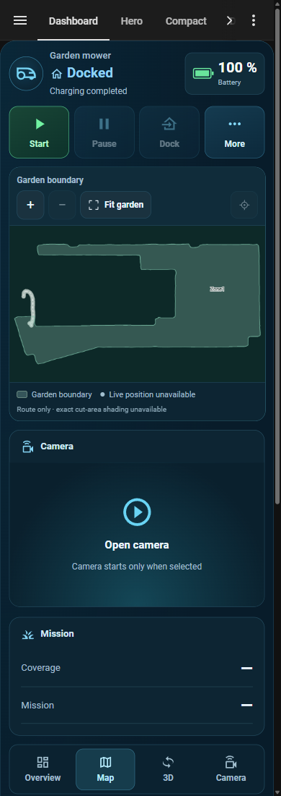

# Layout gallery

[Back to the README](../README.md) · [Configuration](configuration.md) ·
[Maps, video, and 3D](media.md)

These screenshots show Lawn Mower Card running in Home Assistant with a Dreame
A2 and its real companion entities. The mower is docked, so mission values are
blank and no live position is shown. The Hero overview uses the card's built-in
background image; the Camera tab opens the separate video feed.

Replace the example entity IDs with yours. Optional maps, schedules, settings,
and 3D require an integration that exposes those capabilities.

## Dashboard

Dashboard puts the main actions above the media view, with a separate camera
panel and mission summary beside it on wide cards. Schedules and settings stay
below. The camera starts only when opened.


```yaml
type: custom:lawn-mower-card
entity: lawn_mower.my_mower
name: Garden mower
layout: hero
hero_layout: dashboard
map_entity: camera.my_mower_map
show_helper_actions: false
```

On a phone, the same layout stacks the media, camera, and mission panels. This
capture shows the upper portion; schedules and settings continue below it.



## Cinematic Hero

Use Hero for an image-led overview. Choose your own background and focus point
in the visual editor; the Map, 3D, and Camera tabs use the same companion
entities.


```yaml
type: custom:lawn-mower-card
entity: lawn_mower.my_mower
name: Garden mower
layout: hero
map_entity: camera.my_mower_map
show_helper_actions: false
```

## On-demand 3D

The 3D tab renders a real point cloud delivered by the mower integration. Use
the viewer to orbit and zoom, change point size, or reset the view. Loading is
on demand; a normal dashboard visit does not generate a 3D map.


The screenshots use the Dreame integration's admin-only point-cloud endpoint.
Other mower integrations need a compatible endpoint to offer this view. See
[3D setup and limits](media.md#3d-point-clouds).

## Default and Compact

These presets follow the Home Assistant theme. Default keeps the map visible;
Compact can omit media for a smaller control card. Both examples explicitly
select the map control instead of showing every automatically discovered
setting. Available schedules still appear automatically.

| Default with map | Compact without media |
| --- | --- |
|  |  |

```yaml
type: custom:lawn-mower-card
entity: lawn_mower.my_mower
name: Garden mower
layout: compact
show_map: false
show_point_cloud: false
show_helper_actions: false
control_entities:
  - select.my_mower_map
```

For the Default example, use `layout: default`, add
`map_entity: camera.my_mower_map`, and set `show_map: true`.

The number of available controls depends on the integration and selected
companions. A route records observed movement, not verified cut-area coverage.
