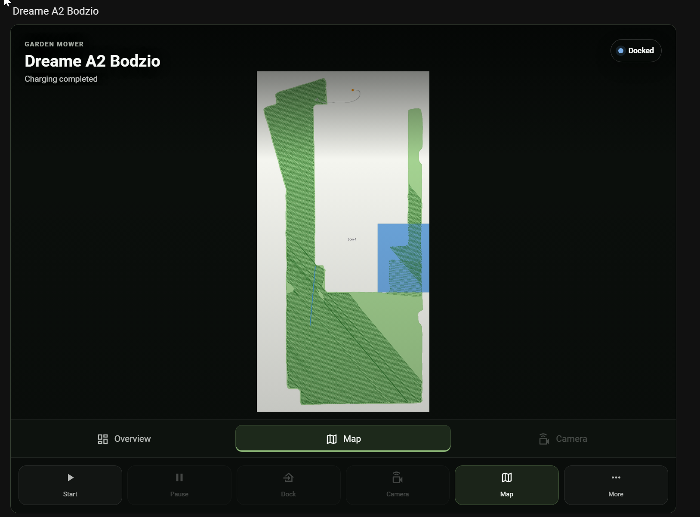

# Maps, video, and 3D

[Back to the README](../README.md) · [Configuration](configuration.md)

## Interactive mowing map

When the selected map camera exposes `mowing_map_api_path`, the Map view supports
dragging, wheel or pinch zoom, **Fit garden**, and **Centre on mower**. Keyboard
users can use the arrow keys, plus/minus, and Home. The garden background stays
loaded while fresh position and current-run movement update separately.

In Hero layout, a mowing session initially opens Map. Choosing another view
overrides that default. Battery, reported current/target area, progress, and mower
controls remain available in the card. Stale positions are hidden, and the
trail is labelled **Observed movement · not cut-area coverage**; it does not
claim that every enclosed patch has been cut.

The visual editor prefers a compatible primary map camera for new automatic
selections. Existing explicit `map_entity` choices are preserved. With the Dreame
integration, choose the primary Map camera to enable this view; an older
integration or a camera without the attribute continues to show its map image.

## 3D Point Clouds

The Dreame Lawn Mower integration can provide a 3D point cloud through its Map
camera. A Home Assistant administrator can load it directly in the card.

The download is deliberately on demand:

- in Hero, select the **3D** tab
- in compact, default, or wide layouts, press **Load 3D map**
- use the viewer to orbit, pan, zoom, change point size, reset, or refresh
- press **PCD** to make a separate signed request for the original file; the
  viewer does not retain the large downloaded source buffer after parsing

An ordinary dashboard render does not generate or fetch garden geometry. The
card never receives the vendor cloud URL or transient object name; it sees only
the integration-owned Home Assistant path. The integration currently limits
this endpoint to Home Assistant administrators, so non-admin users receive an
access message instead of the point cloud.

Larger point clouds first show a preview, then replace it with more detail.
Returning to the Hero 3D tab reuses the same scene and camera view.

While the mower prepares a fresh file, the viewer shows elapsed time and the
integration's normal 45-second generation window. The browser stops a request
after 65 seconds so a broken connection cannot leave the card spinning
indefinitely. Newer integration versions return a privacy-safe problem code,
stage, duration, and retryability flag; the card presents those details with
the next useful action. Older versions still receive the HTTP-status fallback.

If generation repeatedly fails, retry once and then download the mower
integration diagnostics before restarting Home Assistant. Include the visible
`point_cloud_*` reference in the issue report. The card never displays or stores
vendor URLs, transient object names, or point coordinates as troubleshooting
data.

## Media behavior

Unrelated Home Assistant state changes do not redraw the card. Hidden pages
suspend media immediately; a card scrolled off screen gets a 15-second grace
period before suspending. Media resumes when the card is visible again.
Integration-provided restart map images are labelled **Saved preview**, not
**Live**.

Live video starts only when selected. Home Assistant's camera player uses an
available WebRTC provider or falls back to HLS. A snapshot stays behind the
player during startup. Leaving Camera keeps the same player warm for 15 seconds
so a quick return does not restart playback.

## If a view is missing or unavailable

Check that the companion camera is enabled in Home Assistant and selected in
the card editor. A basic mower without map or video entities does not show those
tabs. Check the integration's own camera and diagnostics before treating a
playback error as a card problem.

For narrow desktop dashboard columns, use **Hero**, **Default**, or **Compact**.
The older **Wide** preset currently uses a browser-width breakpoint and can
squeeze its two columns inside a narrow card.
